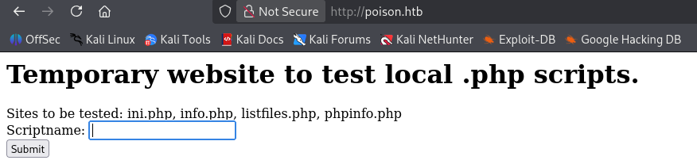
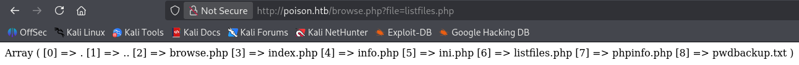

## Overview

Poison is a medium rated Linux box. It focuses mainly on log poisoning and port forwarding/tunneling. Personally, I did not use log poisoning to gain a foothold on the machine. There was an alternative way of logging in as a user via SSH using credentials found in `pwdbackup.txt` which was listed out by the `listfiles.php` file. There is also LFI in the `file` parameter of `browse.php` that allowed me to view `/etc/passwd` of the machine to see who the credentials belonged to. From the SSH session, I found a `secret.zip` that I exfiltrated to my attacker machine. The zip was password protected, but luckily reused the credentials from earlier and I acquired a `secret` file. This was used to access a VNC session as root which needed to be port forwarded to my attacker machine.

## Nmap Scan

```
# Nmap 7.99 scan initiated Fri Sep 25 03:02:17 2026 as: /usr/lib/nmap/nmap --privileged -sCV -T4 -p- -vvv --open -oN scan 10.129.1.254
Nmap scan report for 10.129.1.254
Host is up, received echo-reply ttl 63 (0.18s latency).
Scanned at 2026-09-25 03:02:20 PDT for 114s
Not shown: 46260 filtered tcp ports (no-response), 19273 closed tcp ports (reset)
Some closed ports may be reported as filtered due to --defeat-rst-ratelimit
PORT   STATE SERVICE REASON         VERSION
22/tcp open  ssh     syn-ack ttl 63 OpenSSH 7.2 (FreeBSD 20161230; protocol 2.0)
| ssh-hostkey:
|   2048 e3:3b:7d:3c:8f:4b:8c:f9:cd:7f:d2:3a:ce:2d:ff:bb (RSA)
| ssh-rsa AAAAB3NzaC1yc2EAAAADAQABAAABAQDFLpOCLU3rRUdNNbb5u5WlP+JKUpoYw4znHe0n4mRlv5sQ5kkkZSDNMqXtfWUFzevPaLaJboNBOAXjPwd1OV1wL2YFcGsTL5MOXgTeW4ixpxNBsnBj67mPSmQSaWcudPUmhqnT5VhKYLbPk43FsWqGkNhDtbuBVo9/BmN+GjN1v7w54PPtn8wDd7Zap3yStvwRxeq8E0nBE4odsfBhPPC01302RZzkiXymV73WqmI8MeF9W94giTBQS5swH6NgUe4/QV1tOjTct/uzidFx+8bbcwcQ1eUgK5DyRLaEhou7PRlZX6Pg5YgcuQUlYbGjgk6ycMJDuwb2D5mJkAzN4dih
|   256 4c:e8:c6:02:bd:fc:83:ff:c9:80:01:54:7d:22:81:72 (ECDSA)
| ecdsa-sha2-nistp256 AAAAE2VjZHNhLXNoYTItbmlzdHAyNTYAAAAIbmlzdHAyNTYAAABBBKXh613KF4mJTcOxbIy/3mN/O/wAYht2Vt4m9PUoQBBSao16RI9B3VYod1HSbx3PYsPpKmqjcT7A/fHggPIzDYU=
|   256 0b:8f:d5:71:85:90:13:85:61:8b:eb:34:13:5f:94:3b (ED25519)
|_ssh-ed25519 AAAAC3NzaC1lZDI1NTE5AAAAIJrg2EBbG5D2maVLhDME5mZwrvlhTXrK7jiEI+MiZ+Am
80/tcp open  http    syn-ack ttl 63 Apache httpd 2.4.29 ((FreeBSD) PHP/5.6.32)
|_http-title: Site doesn't have a title (text/html; charset=UTF-8).
| http-methods:
|_  Supported Methods: GET HEAD POST OPTIONS
|_http-server-header: Apache/2.4.29 (FreeBSD) PHP/5.6.32
Service Info: OS: FreeBSD; CPE: cpe:/o:freebsd:freebsd
```

## HTTP - Port 80

The website is hosted on `Apache` and running `PHP` in the backend. I'm able to test some php files that are listed in "Sites to be tested".


I decided to test `listfiles.php` because it looked interesting. It gave me an array of files, but the one that caught my eye was a `pwdbackup.txt` file.


Navigating to that file showed me this:
